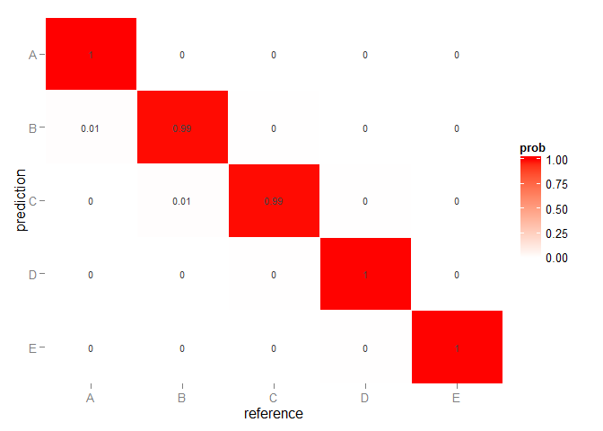

# Practical Machine Learning Project
author:Mikhail SH  
date:21.03.2015  

### Background

Using devices such as Jawbone Up, Nike FuelBand, and Fitbit it is now possible to collect a large amount of data about personal activity relatively inexpensively. These type of devices are part of the quantified self movement - a group of enthusiasts who take measurements about themselves regularly to improve their health, to find patterns in their behavior, or because they are tech geeks. One thing that people regularly do is quantify how much of a particular activity they do, but they rarely quantify how well they do it. In this project, your goal will be to use data from accelerometers on the belt, forearm, arm, and dumbell of 6 participants. They were asked to perform barbell lifts correctly and incorrectly in 5 different ways. More information is available from the website here: http://groupware.les.inf.puc-rio.br/har (see the section on the Weight Lifting Exercise Dataset).

### Data

The training data for this project are available here: [https://d396qusza40orc.cloudfront.net/predmachlearn/pml-training.csv]

The test data are available here: [https://d396qusza40orc.cloudfront.net/predmachlearn/pml-testing.csv]

The data for this project come from this source: [http://groupware.les.inf.puc-rio.br/har]. 

### Goal

The goal is to find a model that can predicht the classes below based on the sensor data of an activity. (A,B,C,D,E)

## Loading data


```r
set.seed(123)
library(caret);
dataset_test <- read.table("pml-testing.csv", header = TRUE, sep = ",", quote = "\"",
                           dec = ".", fill = TRUE)

dataset_train <- read.table("pml-training.csv", header = TRUE, sep = ",", quote = "\"",
                            dec = ".", fill = TRUE)
```

## Creating training and testset for cross validation

To be able to validate the model the provided trainingset will be split in a training and testset for the modelling.


```r
inTrain <- createDataPartition(y=dataset_train$classe,
                               p=0.75, list=FALSE)
set.seed(123)
training <- dataset_train[inTrain,]
testing <-  dataset_train[-inTrain,]
```


## Cleaning data

The data needs to be cleaned before it can be used for modelling. 

1. Remove some zero variance predictors.
2. Remove the first columns (id, timestamps, subject name) because they are not usefull in predicting.
3. Remove any column that has 'NA' greater than 15% of the column length.
4. Remove column with Hight Correlation


```r
training_step1 <- training[, -nearZeroVar(training)]

myvars <- names(training_step1) %in% c("classe", "user_name", "raw_timestamp_part_1", "raw_timestamp_part_2", "cvtd_timestamp", "num_window")
training_step2  <- training_step1[!myvars]

training_step3 = training_step2[, colMeans(is.na(training_step2)) <= .15]

training_step4 <- training_step3[, -findCorrelation(cor(training_step3), .95)]
```

## Cross validation

The default resampling scheme for the caret train function is bootstrap. I have used custom settings instead by setting the below `trainControl`.

The out of sample error should be higher than the in sample error because the the model is based on the training set and will therefor most likely have a slightly worst performance on the testset. This will be shown further in the project.

## Selecting variables

First I made a model on a training set. Then I selected the 20 most important variables with `varImp` and run the model again. I repeated this, meanwhile balancing the accurancy and number of variables. 

# Random forest model 
rfFit <- train(classe ~ .,method="rf", data=training_end[,c(-1)])


```r
rfFit
```

```
## Random Forest 
## 
## 14718 samples
##    48 predictor
##     5 classes: 'A', 'B', 'C', 'D', 'E' 
## 
## No pre-processing
## Resampling: Bootstrapped (25 reps) 
## 
## Summary of sample sizes: 14718, 14718, 14718, 14718, 14718, 14718, ... 
## 
## Resampling results across tuning parameters:
## 
##   mtry  Accuracy   Kappa      Accuracy SD  Kappa SD   
##    2    0.9882875  0.9851789  0.001865736  0.002356148
##   25    0.9893162  0.9864806  0.001916750  0.002425926
##   48    0.9782662  0.9724965  0.005619643  0.007118020
## 
## Accuracy was used to select the optimal model using  the largest value.
## The final value used for the model was mtry = 25.
```

```r
#rfFit$finalModel
```

# Confusion matrix for Random forest ( include all variables ) 

```
## Confusion Matrix and Statistics
## 
##           Reference
## Prediction    A    B    C    D    E
##          A 1395    0    0    0    0
##          B    1  947    1    0    0
##          C    0    6  849    0    0
##          D    0    0    4  799    1
##          E    0    0    0    2  899
## 
## Overall Statistics
##                                          
##                Accuracy : 0.9969         
##                  95% CI : (0.995, 0.9983)
##     No Information Rate : 0.2847         
##     P-Value [Acc > NIR] : < 2.2e-16      
##                                          
##                   Kappa : 0.9961         
##  Mcnemar's Test P-Value : NA             
## 
## Statistics by Class:
## 
##                      Class: A Class: B Class: C Class: D Class: E
## Sensitivity            0.9993   0.9937   0.9941   0.9975   0.9989
## Specificity            1.0000   0.9995   0.9985   0.9988   0.9995
## Pos Pred Value         1.0000   0.9979   0.9930   0.9938   0.9978
## Neg Pred Value         0.9997   0.9985   0.9988   0.9995   0.9998
## Prevalence             0.2847   0.1943   0.1741   0.1633   0.1835
## Detection Rate         0.2845   0.1931   0.1731   0.1629   0.1833
## Detection Prevalence   0.2845   0.1935   0.1743   0.1639   0.1837
## Balanced Accuracy      0.9996   0.9966   0.9963   0.9981   0.9992
```
 **OOB estimate of  error rate: 0.67%**

# Selecting top 20 variables 

```r
vI <- varImp(rfFit$finalModel)
vI$sample <- row.names(vI); vI <- vI[order(vI$Overall, decreasing = T),]
PredictorVariables <- vI$sample[1:20]
PredictorVariables
```

```
##  [1] "yaw_belt"             "pitch_forearm"        "pitch_belt"          
##  [4] "magnet_dumbbell_z"    "magnet_dumbbell_y"    "roll_forearm"        
##  [7] "magnet_belt_y"        "gyros_belt_z"         "magnet_belt_z"       
## [10] "roll_dumbbell"        "accel_dumbbell_y"     "magnet_dumbbell_x"   
## [13] "accel_forearm_x"      "total_accel_dumbbell" "accel_forearm_z"     
## [16] "accel_dumbbell_z"     "magnet_belt_x"        "magnet_forearm_z"    
## [19] "total_accel_belt"     "yaw_arm"
```

```r
Formula <- formula(paste("classe ~ ",
                         paste(PredictorVariables, collapse=" + ")))
```


```r
rfFit_top20 <- train(Formula,method="rf", data=training_end[,c(-1)])
```


```r
rfFit_top20
```

```
## Random Forest 
## 
## 14718 samples
##    48 predictor
##     5 classes: 'A', 'B', 'C', 'D', 'E' 
## 
## No pre-processing
## Resampling: Bootstrapped (25 reps) 
## 
## Summary of sample sizes: 14718, 14718, 14718, 14718, 14718, 14718, ... 
## 
## Resampling results across tuning parameters:
## 
##   mtry  Accuracy   Kappa      Accuracy SD  Kappa SD   
##    2    0.9870465  0.9836116  0.001943804  0.002455707
##   11    0.9863396  0.9827194  0.002199387  0.002778449
##   20    0.9763235  0.9700494  0.004115726  0.005199993
## 
## Accuracy was used to select the optimal model using  the largest value.
## The final value used for the model was mtry = 2.
```

```r
rfFit_top20$finalModel
```

```
## 
## Call:
##  randomForest(x = x, y = y, mtry = param$mtry) 
##                Type of random forest: classification
##                      Number of trees: 500
## No. of variables tried at each split: 2
## 
##         OOB estimate of  error rate: 0.91%
## Confusion matrix:
##      A    B    C    D    E class.error
## A 4176    8    0    0    1 0.002150538
## B   25 2800   21    2    0 0.016853933
## C    0   23 2536    8    0 0.012076354
## D    0    1   30 2379    2 0.013681592
## E    0    0    4    9 2693 0.004804139
```

```r
confusionMatrix(testing$classe,predict(rfFit_top20,testing))
```

```
## Confusion Matrix and Statistics
## 
##           Reference
## Prediction    A    B    C    D    E
##          A 1395    0    0    0    0
##          B    6  942    1    0    0
##          C    0    5  848    2    0
##          D    0    0    2  802    0
##          E    0    0    0    2  899
## 
## Overall Statistics
##                                           
##                Accuracy : 0.9963          
##                  95% CI : (0.9942, 0.9978)
##     No Information Rate : 0.2857          
##     P-Value [Acc > NIR] : < 2.2e-16       
##                                           
##                   Kappa : 0.9954          
##  Mcnemar's Test P-Value : NA              
## 
## Statistics by Class:
## 
##                      Class: A Class: B Class: C Class: D Class: E
## Sensitivity            0.9957   0.9947   0.9965   0.9950   1.0000
## Specificity            1.0000   0.9982   0.9983   0.9995   0.9995
## Pos Pred Value         1.0000   0.9926   0.9918   0.9975   0.9978
## Neg Pred Value         0.9983   0.9987   0.9993   0.9990   1.0000
## Prevalence             0.2857   0.1931   0.1735   0.1644   0.1833
## Detection Rate         0.2845   0.1921   0.1729   0.1635   0.1833
## Detection Prevalence   0.2845   0.1935   0.1743   0.1639   0.1837
## Balanced Accuracy      0.9979   0.9965   0.9974   0.9973   0.9998
```
** OOB estimate of  error rate: 0.91% **

#The confusion matrix of the test set is illustrated on Figure 

```r
conf_rf <- as.data.frame(confusionMatrix(testing$classe,predict(rfFit_top20,testing))[2])
conf_rf <- conf_rf %>% rename(prediction = table.Prediction, reference = table.Reference, count = table.Freq) %>% 
        arrange(desc(prediction)) %>% group_by(prediction) %>% mutate(prob = count/sum(count)) %>% ungroup
ggplot(conf_rf, aes(reference, prediction)) + 
        geom_tile(aes(fill = prob), colour = "white") + 
        geom_text(aes(fill = prob, label = round(prob, 2)), size=3, colour="grey25") +
        scale_fill_gradient(low = "white", high = "red") +
        scale_x_discrete(expand = c(0, 0)) +
        scale_y_discrete(expand = c(0, 0), limits = c("E","D","C","B","A")) 
```

 

## Prediction using Random forest model
The random forest model with top 20 variables is used to predict. 

Below the submission files are generated

```r
pml_write_files = function(x){
        n = length(x)
        for(i in 1:n){
                filename = paste0("problem_id_",i,".txt")
                write.table(x[i],file=filename,quote=FALSE,row.names=FALSE,col.names=FALSE)
        }
}

final_predictions <- predict(rfFit_top20, dataset_test)
final_predictions
```

```
##  [1] B A B A A E D B A A B C B A E E A B B B
## Levels: A B C D E
```

```r
pml_write_files(final_predictions)
```


